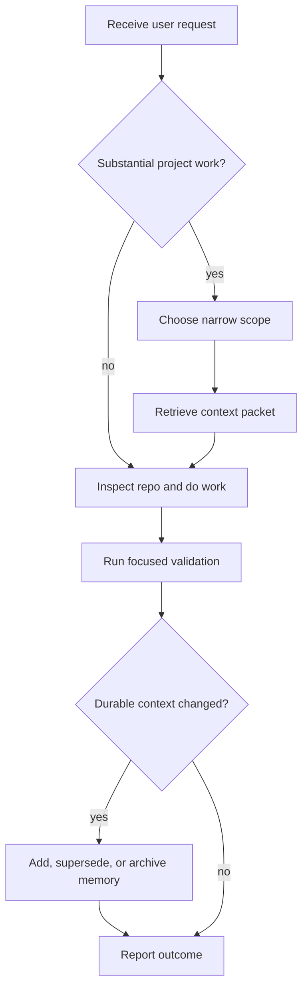
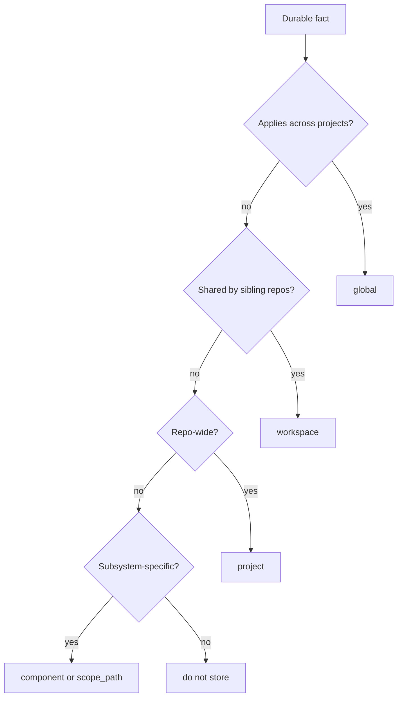

# Agent Workflow

This guide explains how coding agents should use `memory-mcp` to reduce token
usage and improve task-specific context quality.

## Goal

Before substantial work, retrieve only the durable context that matters for the
current request. After meaningful work, store only durable, non-sensitive facts
that will make a future session faster or more accurate.

## Default Loop



## Retrieval Rules

Use `get_context_packet` for implementation, review, planning, and debugging
that benefits from durable context.

Prefer the narrowest available scope:

1. `scope_path` for branch, feature, module, or nested app context.
2. `component` for a subsystem such as retrieval, auth, UI, deployment, or
   tests.
3. `project` for repo-wide facts.
4. `workspace` for facts shared by sibling repositories.
5. `global` for durable cross-project preferences and rules.

Default options:

```json
{
  "include_sensitive": false,
  "include_evidence": false,
  "include_global": true,
  "include_inherited": true,
  "max_memories": 8,
  "max_tokens": 1200
}
```

## Feature Context Example

```json
{
  "request": "What should I remember while changing retrieval ranking?",
  "workspace": "ai",
  "project": "memory-mcp",
  "component": "retrieval",
  "include_global": true,
  "max_memories": 8,
  "max_tokens": 1200
}
```

## Branch-Aware Example

```json
{
  "request": "Current feature context for scoped memory override behavior",
  "scope_path": [
    "global",
    "workspace:ai",
    "project:memory-mcp",
    "repo:memory-mcp",
    "module:retrieval",
    "branch:scoped-overrides",
    "feature:override-filtering"
  ],
  "include_inherited": true,
  "max_memories": 8,
  "max_tokens": 1200
}
```

## Applying Retrieved Context

Treat context packets as guidance, not as a replacement for reading the code.

Use the packet to:

- Pick the right subsystem to inspect first.
- Recall project-specific setup, commands, and safety constraints.
- Avoid repeating old architectural discussions.
- Respect current conventions.
- Detect when a stored fact may be stale and should be verified.

Then inspect the relevant files directly before editing.

## Memory Write Rules

Store memory after meaningful work when the new fact is durable and likely to
help future sessions.

MCP mutation tools are disabled by default. Enable
`MEMORY_MCP_ENABLE_MUTATION_TOOLS=true` only for trusted local clients before
writing, archiving, superseding, or pruning memory.

Good candidates:

- New or changed architecture boundaries.
- Stable setup, test, migration, or validation commands.
- Public API behavior.
- Repository conventions.
- Durable security constraints.
- Component-specific gotchas.
- Superseded facts that should no longer guide future work.

Do not store:

- Secrets, tokens, credentials, or connection strings.
- Raw terminal logs.
- Full transcripts.
- Temporary debugging observations.
- Speculation.
- User-private or sensitive information without explicit confirmation.

## Write Scope Selection



## Refresh Examples

Project-wide fact:

```json
{
  "memory_type": "project_fact",
  "summary": "memory-mcp docs define context reduction as the core product goal.",
  "content": "The memory-mcp documentation states that the product goal is to reduce context/token usage by retrieving compact, scoped context packets for the current coding task.",
  "memory_scope": "project",
  "workspace": "ai",
  "project": "memory-mcp",
  "tags": ["docs", "goals"]
}
```

Component fact:

```json
{
  "memory_type": "project_fact",
  "summary": "Retrieval ranks by text, confidence, and recency.",
  "content": "memory-mcp retrieval ranks memory results with PostgreSQL full-text rank, confidence, and recency, after applying structured filters.",
  "memory_scope": "component",
  "workspace": "ai",
  "project": "memory-mcp",
  "component": "retrieval",
  "tags": ["retrieval", "ranking"]
}
```

Branch override:

```json
{
  "memory_type": "project_fact",
  "summary": "Scoped override branch changes inherited memory filtering.",
  "content": "On the scoped-overrides branch, retrieval hides parent memories listed in lower-scope overrides_memory_ids.",
  "scope_path": [
    "global",
    "workspace:ai",
    "project:memory-mcp",
    "repo:memory-mcp",
    "module:retrieval",
    "branch:scoped-overrides"
  ],
  "overrides_memory_ids": ["00000000-0000-0000-0000-000000000000"],
  "tags": ["retrieval", "branch-note"]
}
```

## Review Checklist For Agents

- Did I retrieve memory before substantial work?
- Did I use the narrowest available scope?
- Did I keep sensitive memory excluded unless explicitly needed?
- Did I avoid enabling mutation or sensitive MCP capabilities for untrusted
  clients?
- Did I read the relevant source files instead of trusting memory alone?
- Did I run focused validation?
- Did I refresh only durable project context?
- Did I avoid storing secrets or temporary notes?
