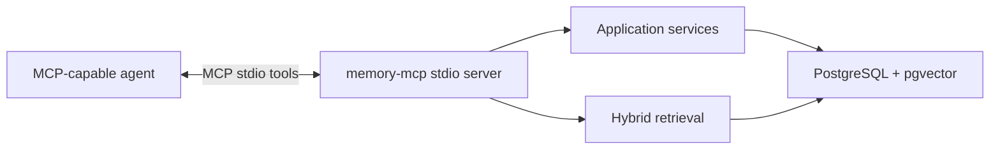
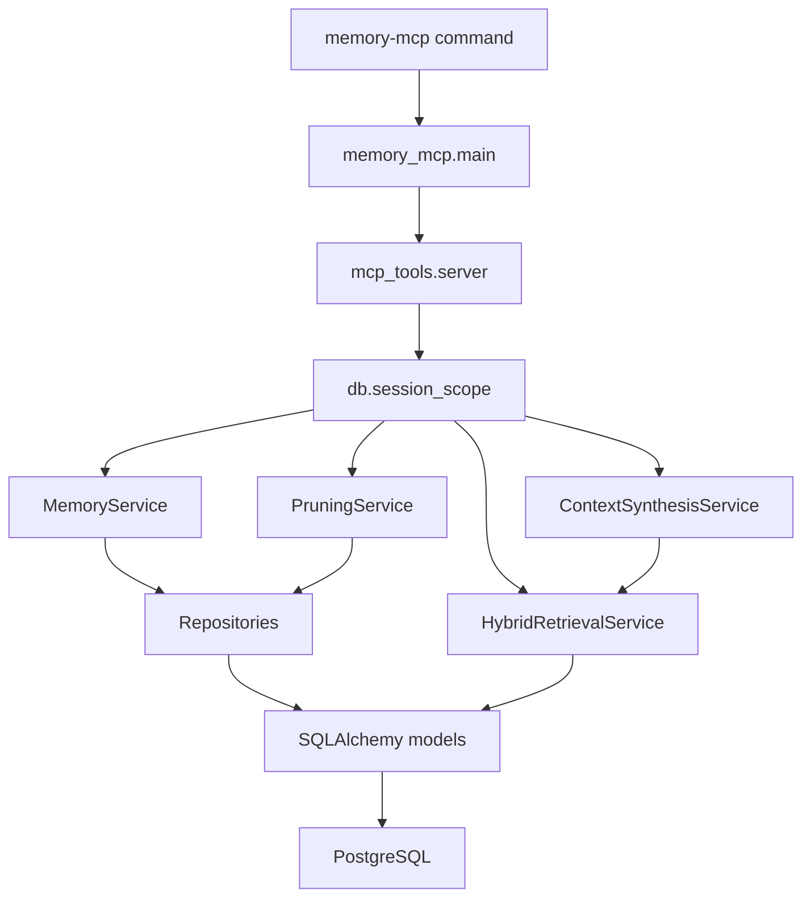
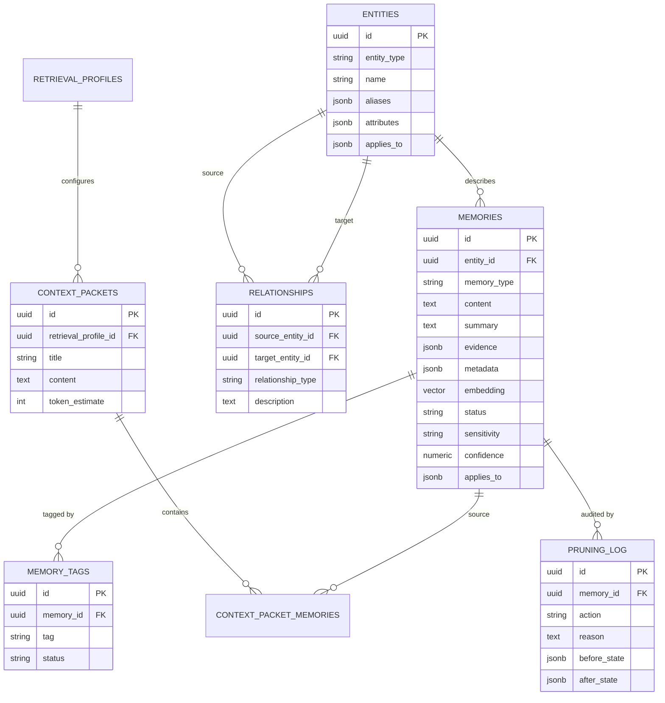
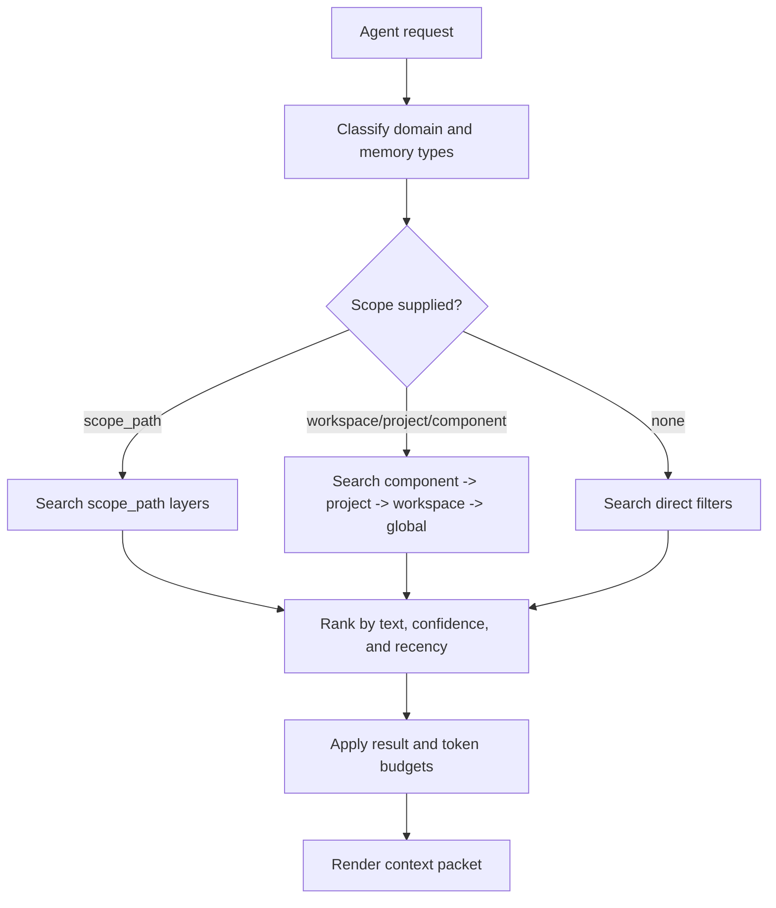
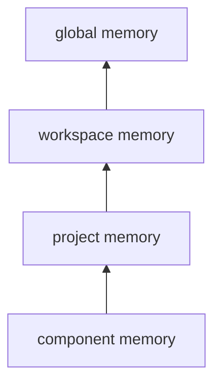
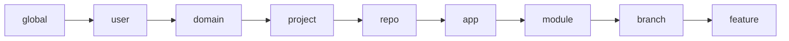
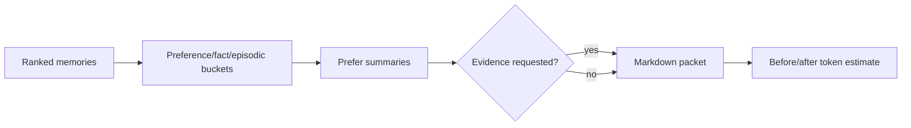
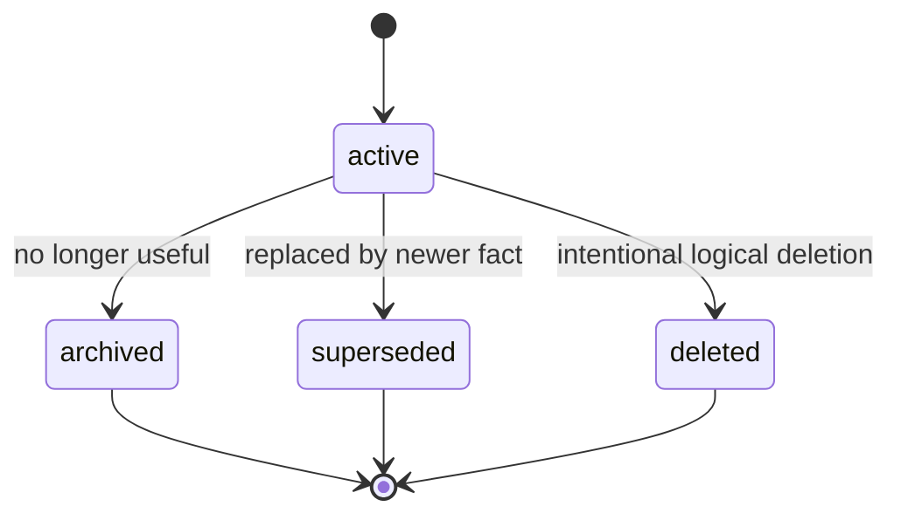
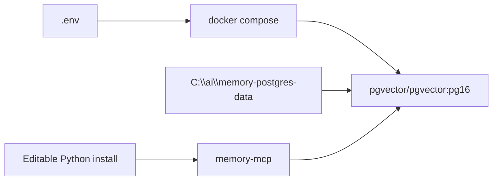

# Architecture

## Overview

`memory-mcp` is a local Python MCP stdio server backed by PostgreSQL. It stores
structured memories and exposes tools that retrieve compact, task-specific
context for coding agents.

## Runtime Components

## Storage Model

The database keeps durable context as lifecycle-aware rows. Most tables include
confidence, sensitivity, status, and `applies_to` scope metadata.

## MCP Tool Surface

| Tool | Purpose |
| --- | --- |
| `add_memory` | Store a new memory with optional scope, tags, evidence, and lifecycle metadata. |
| `archive_memory` | Mark a memory archived. |
| `supersede_memory` | Replace an outdated memory while preserving lineage. |
| `search_memory` | Search memories using structured filters, text, tags, scope, and sensitivity controls. |
| `get_context_packet` | Generate a compact LLM-ready packet for a task. |
| `list_preferences` | Retrieve preference memories by domain and scope. |
| `list_liked_media` | Retrieve liked entertainment preferences. |
| `list_disliked_media` | Retrieve disliked entertainment preferences. |
| `list_medications_for_person` | Retrieve medication memories for an explicit person ID. |
| `summarize_domain_profile` | Summarize a domain as a bounded context packet. |
| `run_pruning_pass` | Archive, supersede, compress, and decay memory according to pruning rules. |

## Retrieval Flow

Ranking combines:

- PostgreSQL full-text rank across memory content and summary.
- Confidence score.
- Recency score.
- Structured filters for memory type, status, sensitivity, tags, `applies_to`,
  scope, and minimum confidence.

Vector search is scaffolded only. The `memories.embedding` column and pgvector
extension are available, but embedding generation and HNSW indexing are deferred
until a fixed embedding model and dimension are selected.

## Scope Hierarchy

Classic hierarchy fields are stored in `applies_to`:

Use these scopes when the project, component, and workspace are enough:

- `memory_scope="global"`
- `memory_scope="workspace"` plus `workspace`
- `memory_scope="project"` plus `project`
- `memory_scope="component"` plus `project` and `component`

Use `scope_path` when context needs more layers, such as repo, app, module,
branch, feature, or session.

When `include_inherited=true`, retrieval walks from the direct scope back
toward the root. Lower scopes can hide parent facts with
`overrides_memory_ids`, allowing branch-local truth without corrupting main
branch memory.

## Context Packet Synthesis

`ContextSynthesisService` turns retrieval results into a compact packet:

The packet includes:

- Request classification.
- Preferences.
- Facts.
- Episodic context.
- Optional evidence.
- Raw-context token estimate.
- Rendered-packet token estimate.
- Reduction percentage.

## Lifecycle

Lifecycle rules:

- Active memory is eligible for normal retrieval.
- Archived memory is preserved but hidden from normal context.
- Superseded memory is preserved for lineage and audit.
- Deleted is a logical status, not a physical purge.
- Pruning writes decisions to `pruning_log`.

## Safety Boundaries

- The server is designed for trusted local stdio clients.
- Default retrieval includes only `normal` sensitivity memory.
- `MEMORY_MCP_ENABLE_MUTATION_TOOLS=true` is required for MCP write, archive,
  supersede, and pruning tools.
- `MEMORY_MCP_ENABLE_SENSITIVE_TOOLS=true` plus `include_sensitive=true` is
  required for sensitive and private reads.
- Evidence is omitted by default in most tools.
- Write tools return minimal metadata by default and require explicit
  `include_content` or `include_evidence` echo.
- Text, JSON payloads, tag counts, result counts, scope paths, and token budgets
  are bounded at the MCP tool layer.
- Secrets and credentials should never be stored as memory.

## Local Deployment

The default database binds to `127.0.0.1` and stores PostgreSQL files in a host
directory outside the repository. Keep that directory protected because it can
contain personal, project, and sensitive memory.
