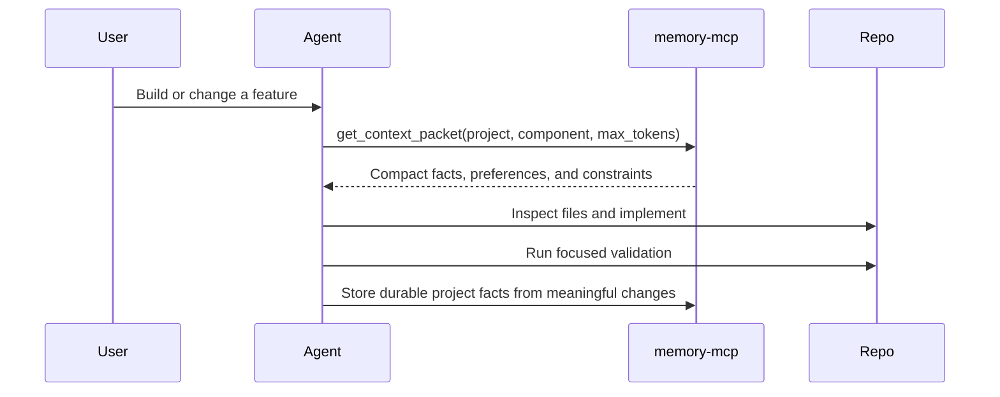
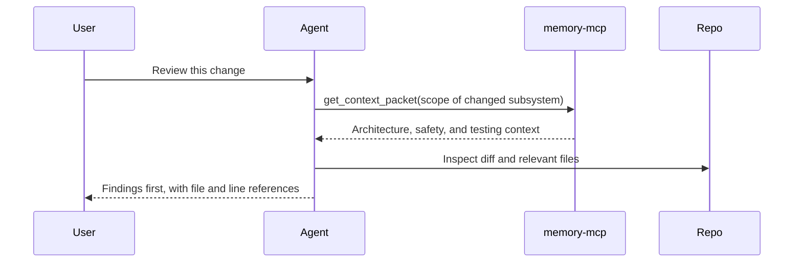
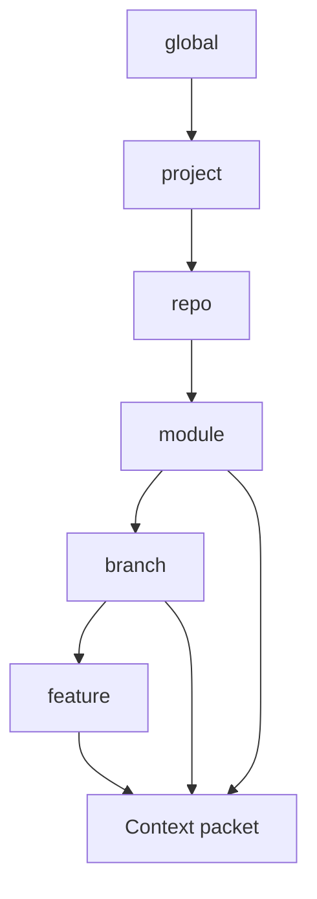

# Goals

## Mission

`memory-mcp` exists to make coding agents more efficient by retrieving the
right context for the current feature while reducing context and token usage.

The application should help an agent answer this question quickly:

> What do I need to remember for this task, and what can I safely leave out?

## Primary Goal

Reduce the amount of repeated context loaded into coding sessions while
improving the relevance of the information an agent receives for a given
feature, bug, review, or planning task.

In practical terms, `memory-mcp` should replace broad manual context loading
with compact, scoped packets that contain:

- Stable project facts.
- Relevant architecture decisions.
- Current component conventions.
- Durable workflow and testing commands.
- User or team coding preferences.
- Explicitly requested sensitive facts only when appropriate.

## Why This Matters

Coding agents often waste context on stale notes, duplicate summaries, long
conversation history, unrelated files, or whole-repo background. That raises
token costs and can reduce answer quality because the useful facts compete with
noise.

`memory-mcp` should make context retrieval selective:

- Pull component context before project context.
- Pull project context before workspace context.
- Pull workspace context before global context.
- Exclude sensitive memory by default.
- Prefer compact summaries over raw evidence unless the task needs evidence.
- Bound result count and token budget.

## Success Metrics

Track these metrics as the project matures:

| Metric | Target |
| --- | --- |
| Context packet token reduction | Typical packet reduces raw memory context by at least 70%. |
| Relevance | At least 80% of returned memories should be directly useful for the requested task in manual review. |
| Setup reliability | Fresh local setup succeeds with documented commands on Windows. |
| Retrieval precision | Scoped retrieval should prefer component and project facts over broad global facts. |
| Safety | Normal searches should not return sensitive or private memories unless explicitly enabled. |
| Maintenance | Pruning should reduce stale or duplicate active memory without deleting evidence. |

## Product Principles

- **Scoped first**: retrieval starts from the narrowest known scope and widens
  only as needed.
- **Compact by default**: summaries are preferred, evidence is opt-in, and
  context packets enforce token budgets.
- **Durable, not conversational**: store reusable facts, decisions, and
  preferences, not transcripts or temporary debugging noise.
- **Lifecycle aware**: outdated memory should be superseded or archived instead
  of left active.
- **Local first**: personal and project memory stay in local PostgreSQL unless
  the operator intentionally syncs or backs up the data.
- **Safe by default**: sensitive and private data are excluded unless a trusted
  local request explicitly opts in.

## Non-Goals

- Replace source control, issue trackers, design docs, or test suites.
- Store secrets, tokens, credentials, customer data, or raw private transcripts.
- Expose a remote multi-user memory service.
- Guarantee factual correctness without lifecycle maintenance.
- Implement vector search before the embedding model, dimensions, and indexing
  strategy are chosen.

## Target User Workflows

### Feature Work

### Code Review

### Branch-Specific Work

Branch or feature memory can override inherited parent facts without making the
parent fact globally obsolete.

## Roadmap

### Current Foundation

- Local stdio MCP server.
- Dockerized PostgreSQL with pgvector available.
- Structured memory, entity, tag, relationship, context packet, and pruning
  tables.
- Hybrid retrieval using structured filters, full text, confidence, recency,
  hierarchy, and scope paths.
- Context packet synthesis with token estimates and budget enforcement.
- Pruning service for duplicate merge, stale archive, inference decay, and
  summary promotion.

### Near Term

- Improve retrieval classification beyond simple keyword heuristics.
- Add richer documentation examples for common coding-agent workflows.
- Add validation utilities for safe memory writes.
- Add metrics around token reduction and retrieval relevance.
- Add more tests for scope-path override behavior and token-budget edge cases.

### Later

- Choose embedding model and vector dimensions.
- Add embedding generation and pgvector HNSW indexing.
- Add configurable retrieval profiles.
- Add optional UI or reporting for memory health, stale facts, and token
  reduction trends.
- Add import/export tools for portable local backup without exposing secrets.

## Definition Of Done For The Product

`memory-mcp` is succeeding when an agent can enter a large repository, request a
specific feature context, receive a small packet with the facts that matter,
avoid loading unrelated historical material, complete the work, and leave behind
only durable project memory that improves the next session.
