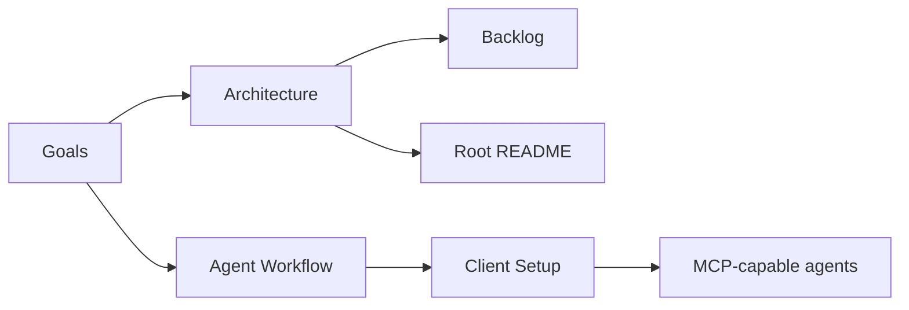

# memory-mcp Documentation

`memory-mcp` is a local-first MCP server for durable, scoped memory. Its purpose
is to give coding agents the smallest useful context packet for the current
task instead of repeatedly loading broad project history, chat transcripts, or
large files.

## Start Here

- [Goals](GOALS.md) explains the product goal, success metrics, non-goals, and
  roadmap.
- [Architecture](ARCHITECTURE.md) explains the system shape, storage model,
  retrieval flow, lifecycle rules, and Mermaid diagrams.
- [SafeMemoryContract](safe_memory_contract.md) defines the trust,
  provenance, review, and executable-instruction boundary for durable memory.
- [Durable Compiled Memory Views](compiled_memory_views.md) defines reusable,
  source-backed, invalidatable orientation summaries.
- [Wiki Ingestion](wiki_ingestion.md) explains indexing a canonical local wiki
  as provenance-stamped, private-by-default projections with deterministic
  reindex and stale-projection archival.
- [Conversation Ingestion](conversation_ingestion.md) defines the evidence,
  review, provenance, sensitivity, and retrieval contract for future transcript
  imports.
- [Backlog](BACKLOG.md) indexes the current GitHub-backed memory safety and
  compiled-view backlog direction.
- [Agent Workflow](AGENT_WORKFLOW.md) explains how agents should retrieve,
  apply, and refresh context during real coding work.
- [AI Indexing](ai-indexing.md) defines the navigation-index contract and its
  deterministic maintenance commands.
- [Benchmarks](../benchmarks/README.md) define task-oriented benchmark cases
  for feature work, bug fixing, and validation planning.
- [Client Setup](../CLIENT_SETUP_README.md) explains how to connect Cursor,
  GitHub Copilot, Codex, and Claude Code.
- [Root README](../README.md) remains the operational setup guide for Docker,
  migrations, seed data, MCP tools, validation, and troubleshooting.

## Design Center

The system is optimized for:

- Lower prompt token usage through compact summaries and bounded retrieval.
- Higher coding accuracy through scoped project, workspace, component, branch,
  and feature context.
- Local-first control over personal and project memory.
- Explicit lifecycle management through active, archived, superseded, and
  deleted statuses.
- Safe defaults that exclude sensitive and private memory unless explicitly
  requested by a trusted local client.

## Documentation Map

## Core Mental Model

Agents should ask `memory-mcp` for narrow, scoped context before substantial
work, do the task with that packet, and refresh only durable project facts after
meaningful changes.

