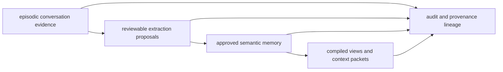
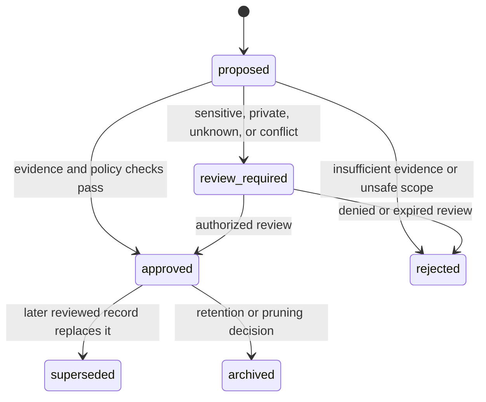

# Conversation Transcript Ingestion Contract

## Purpose and Boundary

This document defines how `memory-mcp` may ingest AI conversations as
**searchable evidence** and derive durable memory from them. It does not make
conversation text canonical, executable, or automatically trusted.

The design separates three durable concerns:



- **Episodic evidence** is raw or lightly normalized conversation material.
  It is retained only under an explicit source and retention policy.
- **Semantic memory** is a durable, reviewed record such as a decision,
  project fact, preference, or troubleshooting observation. It points back to
  evidence; it is not a replacement for evidence.
- **Audit history** records extraction, review, rejection, supersession,
  conflict, and pruning decisions. It must remain available while a derived
  semantic record remains active.
- **Compiled views and context packets** are derived orientation artifacts.
  They are never canonical truth or executable instructions.

This is a phase-1 architecture contract. It defines requirements for later
imports, schema/API changes, retrieval work, consolidation, and refresh; it
does not add a transcript storage table, import adapter, or review UI.

## Source Types and Authority

Supported source types use a closed, extensible vocabulary:

| Source type | Canonical owner | Ingestion role |
|---|---|---|
| `chatgpt_conversation` | ChatGPT export or user-provided archive | Episodic evidence only. |
| `claude_code_session` | Claude Code session artifact | Episodic evidence only. |
| `codex_session` | Codex session artifact | Episodic evidence only. |
| `dark_factory_run` | Dark Factory run artifacts | Operational evidence only. |
| `github_issue_discussion` | GitHub issue | Supporting discussion; GitHub remains authoritative for issue state. |
| `github_pr_discussion` | GitHub pull request | Supporting discussion; GitHub remains authoritative for review/merge state. |
| `ai_os_adapter_conversation` | AI-OS adapter archive | Episodic evidence only. |
| `manual_import` | Import manifest and declared source | Evidence only until reviewed. |

An import must carry an immutable source locator or pointer. If the original
system has a stronger source of truth—especially GitHub issue/PR state—the
pointer is rendered as provenance, not copied into memory as a replacement.

## Archive and Extraction Records

### Episodic conversation archive record

An archive record must include the following fields. Raw bodies and attachments
may be encrypted, access-gated, or stored externally; the record can retain a
stable pointer rather than duplicate them.

```yaml
conversation_id: stable source-native or importer-generated identifier
source_type: chatgpt_conversation | claude_code_session | codex_session | ...
source_uri_or_file: canonical source locator
started_at: RFC 3339 timestamp or null when unknown
ended_at: RFC 3339 timestamp or null when unknown
participants: normalized principal references, not free-form secrets
projects: declared project identifiers
repos: declared repository identifiers
topics: bounded normalized topic labels
sensitivity: normal | sensitive | private | unknown
retention_policy: policy identifier and review/expiry rule
raw_transcript_pointer: access-controlled evidence location
summary_pointer: optional derived-summary location
extracted_records: bounded proposal IDs or immutable proposal pointers
provenance: importer, source hash, capture time, and source version
freshness: current | stale | superseded | unknown
layer: episodic
pruning_policy: archive, retention, and legal/operational hold rules
retrieval_scope: permitted workspace/project/component/scope_path filters
```

`unknown` sensitivity is fail-closed for ordinary retrieval: it cannot enter a
normal context packet or compiled view until classification and policy review
make its treatment explicit. `extracted_records` is an append-only bounded
index of proposals sourced from this archive record. Proposal lifecycle changes
are recorded on the proposals themselves; the archive index is updated only to
add a newly created proposal or replace an invalid pointer, never to erase the
audit relationship.

### Extracted record proposal

Extractors may emit only a proposal with a source pointer, never a silently
trusted memory write. Supported derived record types are:

- `decision`
- `project_context`
- `user_preference`
- `commitment_or_follow_up`
- `backlog_candidate`
- `troubleshooting_observation`
- `model_or_workflow_learning`
- `sensitive_memory_candidate`

Every proposal includes:

```yaml
proposal_id: stable identifier
conversation_id: source archive record
record_type: one of the supported derived record types
summary: bounded derived statement
source_spans: bounded offsets, timestamps, or source-message identifiers
provenance: source locator, source hash, extractor identity and version
confidence: 0.0 to 1.0
sensitivity: normal | sensitive | private | unknown
scope: workspace/project/repo/component/topic/scope_path
consolidation_status: proposed | approved | rejected | superseded
reviewed_by: principal or policy actor when reviewed
reviewed_at: RFC 3339 timestamp when reviewed
superseded_by: proposal or durable-memory identifier when applicable
conflicts_with: bounded identifiers of contradictory proposals or memories
consolidated_from: source proposal identifiers for merged semantic memory
```

Generated summaries, confidence, and inferred links are derived claims. They
must never be represented as a human decision, authorization fact, or policy
instruction unless the appropriate review establishes that status.

## Promotion, Review, and Lifecycle



Promotion into semantic memory requires all of the following:

1. Source provenance and at least one bounded source span or pointer.
2. A declared sensitivity and permitted retrieval scope.
3. A record type permitted by the durable-memory policy.
4. Review whenever the proposal is sensitive, private, unknown, conflicting,
   high-consequence, or would influence a governed side-effect proposal.
5. A reversible lineage from the semantic record to the proposal and archive.

Conflicting proposals are retained and linked for review; they are not merged
into a single fact automatically. A superseded or archived semantic record is
hidden from normal retrieval but its lineage stays available for audit under
the relevant access policy.

Pruning may archive redundant raw evidence only after confirming that it does
not remove the sole provenance or audit trail supporting an active semantic
record. Retention policies may impose stricter preservation, expiry, or hold
rules than ordinary pruning.

## Sensitivity, Redaction, and Access

- Classify source material before broad retrieval, compilation, or model-visible
  summary generation.
- Default transcript-derived material to the least permissive treatment when
  classification is unavailable or ambiguous.
- Store raw text separately from concise, policy-safe summaries and source
  pointers; do not place raw transcripts in normal agent prompts.
- Redact secrets, credentials, account data, medical details, and other
  protected fields before a model-visible extraction step unless an explicitly
  authorized, policy-safe local workflow requires them.
- A sensitive or private proposal is review-required even if its summary is
  short. Redaction changes visibility; it does not erase the need for
  provenance, scope, and review.
- Retrieval and compiled views must apply the existing principal, grant,
  sensitivity, and evidence-echo gates. Client-side hiding is not sufficient.

## Retrieval and Compiled Views

The normal retrieval order is:

1. active, reviewed semantic records within scope and sensitivity policy;
2. current compiled summaries/views with source identifiers and freshness;
3. authoritative external records, such as GitHub issue or PR state;
4. bounded raw transcript excerpts only for provenance, dispute resolution, or
   precise recall.

Raw excerpts require an explicit justification, result limit, token budget, and
access authorization. A context packet should normally render a source-backed
semantic summary, not an archive body.

Compiled views must carry their source record IDs, generation version, scope,
sensitivity ceiling, and freshness state. A view becomes stale when any source
proposal or memory is superseded, archived, deleted, redacted, reclassified,
or changes scope/access eligibility. Stale views are orientation-only until
recomputed; they cannot support a sensitive or side-effecting conclusion.

## Relationship to Existing Auto-Capture

The current hook-driven auto-capture path in [auto_capture.md](auto_capture.md)
creates bounded staging observations for governed distillation. It is not by
itself a canonical conversation archive. A future adapter may map a hook
observation to an episodic archive record only when it supplies the provenance,
sensitivity, retention, and review fields in this contract.

Likewise, a distilled memory is not automatically a verified conversation fact:
the future implementation must preserve the proposal-to-source lineage and use
the promotion rules above.

## Examples

### Architecture decision from a ChatGPT conversation

A user-approved decision is imported as `chatgpt_conversation` evidence. The
extractor proposes a `decision` with exact source-message IDs, project scope,
and `normal` sensitivity. An authorized review approves it; the semantic record
retains the conversation pointer and is rendered in a project decision view.

### Dark Factory troubleshooting observation

A `dark_factory_run` records a reproducible timeout. The proposal is a
`troubleshooting_observation` with run ID, command-version provenance, and a
low confidence until a maintainer verifies it. It can guide investigation but
does not become a durable root cause merely because the model extracted it.

### Personal preference requiring review

A conversation mentions a potentially sensitive preference. The extractor
marks it `sensitive_memory_candidate` with `review_required`; it is excluded
from ordinary project packets until the subject or authorized reviewer approves
both the content and scope.

### Superseded project decision

A later reviewed decision replaces an older approach. The newer semantic record
uses `supersedes_memory_id`; the old decision is marked superseded and remains
available through lineage, while normal context renders only the newer one.

### Consolidating related observations

Several independently sourced timeout observations become one approved project
fact only after conflict checks. The durable fact lists each proposal in
`consolidated_from`, preserving evidence rather than flattening the history.

### Pruning or demoting stale memory

An old workflow note fails freshness review. The semantic record is archived,
its compiled view is invalidated, and the audit trail retains the archive
reason and source pointers under the applicable retention policy.

## Phase-1 Follow-On Slices

This contract deliberately separates implementation work:

1. **Import format and archive boundary** — validate source types, pointers,
   hashes, retention policy, and sensitivity defaults.
2. **Schema/API changes** — model archive records, proposals, source spans,
   review outcomes, and lineage with migration-backed persistence.
3. **Retrieval changes** — add bounded, authorization-aware semantic-first
   retrieval and explicit raw-evidence escalation.
4. **Consolidation review** — implement approval, rejection, conflict, and
   supersession workflows with auditable actors and timestamps.
5. **Compiled-summary refresh** — track source dependencies and invalidate or
   regenerate views after lifecycle, scope, sensitivity, or provenance changes.

Each slice must preserve the existing MCP, scope, sensitivity, token-budget,
and source-read boundaries, with tests proving that raw transcript content and
unreviewed proposals do not leak into normal context.
