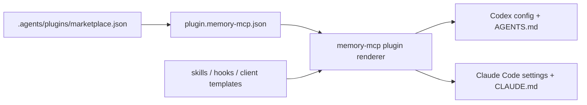

# memory-mcp Plugin Marketplace Model

**Date:** 2026-05-15
**Status:** Draft for review

## Goal

Turn the existing Claude Code and Codex setup templates into a local plugin
marketplace model. Plugins should bundle the skills, hooks, MCP connection
configuration, and agent instructions an application wants its coding clients to
use. The first implementation should make these bundles discoverable and
installable without moving memory retrieval, storage, or hook execution into a
runtime plugin system.

## Current State

`client-setups/` contains static templates for Codex and Claude Code:

- `client-setups/codex/AGENTS.md`
- `client-setups/codex/config.example.toml`
- `client-setups/claude-code/CLAUDE.md`
- `client-setups/claude-code/settings.example.json`
- `client-setups/common/memory-mcp-agent-workflow.md`

`hooks/` contains reusable Python hook entrypoints for Claude Code session and
tool events. The current model works as documentation, but it does not describe
what a pack contains, how packs are listed, how Codex and Claude Code outputs
are rendered from one source of truth, or how teams can host multiple local
packs for different workspaces.

## Recommended Approach

Use a packaging and installer model for the first version.

This keeps the memory-mcp application stable while adding a local marketplace
surface around client assets. The marketplace owns plugin discovery and
installation artifacts; the MCP server continues to own memory retrieval,
storage, auth, and tool behavior.

Rejected alternatives:

- Runtime plugin registry inside the MCP server: more powerful, but it expands
  the trusted execution surface before there is a concrete need for dynamic
  server behavior.
- More static templates: low risk, but it preserves the current duplication and
  does not support a real local marketplace.

## Plugin Shape

Each plugin lives under `plugins/<plugin-name>/` and has a required manifest:

```text
plugins/<plugin-name>/
  .codex-plugin/plugin.json
  plugin.memory-mcp.json
  skills/
  hooks/
  clients/
    codex/
    claude-code/
  README.md
```

`.codex-plugin/plugin.json` follows the Codex plugin manifest convention so the
same package can appear in Codex plugin tooling. `plugin.memory-mcp.json` is the
memory-mcp-specific contract used by the installer. It declares:

- plugin id, display name, description, version, and category
- included skill files
- included hook scripts and supported hook events
- MCP server definitions, including command, args, cwd, and environment hints
- client targets: `codex`, `claude-code`, or both
- install outputs: files to render for the target repository or user-level
  client config

The memory-mcp manifest should be explicit and schema-validated. It should not
execute arbitrary install code in the first version.

## Marketplace Shape

The local marketplace lives at `.agents/plugins/marketplace.json`, matching the
Codex marketplace convention:

```json
{
  "name": "memory-mcp-local-marketplace",
  "interface": {
    "displayName": "memory-mcp Local Marketplace"
  },
  "plugins": [
    {
      "name": "memory-mcp-core",
      "source": {
        "source": "local",
        "path": "./plugins/memory-mcp-core"
      },
      "policy": {
        "installation": "AVAILABLE",
        "authentication": "ON_INSTALL"
      },
      "category": "Developer Tools"
    }
  ]
}
```

Marketplace entries are metadata only. Install behavior comes from the plugin's
memory-mcp manifest.

## First Bundled Plugin

Create `plugins/memory-mcp-core/` as the first marketplace plugin. It packages
the current default workflow:

- shared memory-first agent workflow
- Codex `AGENTS.md` output
- Codex MCP server config output
- Claude Code `CLAUDE.md` output
- Claude Code `settings.json` MCP and hook output
- existing hook scripts for session start, session end, post tool use, and user
  prompt submit

The existing files in `client-setups/` should remain as compatibility templates
for now, but their README should point users to the plugin marketplace path as
the preferred install model.

## Installer Behavior

Add a small Python CLI module, likely under `src/memory_mcp/plugins/`, with a
script entry reachable through the existing `memory-mcp` console command or a
new subcommand once a CLI exists.

Minimum commands:

```text
memory-mcp plugins list --marketplace .agents/plugins/marketplace.json
memory-mcp plugins show memory-mcp-core
memory-mcp plugins render memory-mcp-core --client codex --output <dir>
memory-mcp plugins render memory-mcp-core --client claude-code --output <dir>
```

`render` writes deterministic files into an output directory. It does not edit a
user's live Codex or Claude Code configuration in the first version. This avoids
unsafe config mutation and makes the output easy to review, commit, or copy into
client config through existing setup workflows.

## Data Flow



## Validation And Errors

The installer should validate before rendering:

- marketplace entry points to an existing local plugin path
- both manifests are valid JSON
- plugin names match their directory and marketplace entry
- declared client targets exist
- declared hooks exist under the plugin
- declared MCP server configs include command and args
- output files are deterministic

Errors should be clear and non-destructive. Rendering to an existing non-empty
directory should require an explicit overwrite flag.

## Testing

Use test-first implementation when coding starts.

Expected focused tests:

- manifest loader accepts a valid `memory-mcp-core` plugin
- manifest loader rejects missing required fields
- marketplace loader lists local plugins in marketplace order
- renderer emits Codex outputs from one plugin source
- renderer emits Claude Code outputs from one plugin source
- renderer refuses to overwrite existing output unless explicitly allowed

Existing hook tests should stay in place. Hook behavior does not change in this
first slice.

## Out Of Scope

- Dynamic runtime loading of Python code into the MCP server
- Remote marketplace fetching
- Signed plugins or trust policy
- Automatic mutation of live Codex or Claude Code config files
- Cross-platform shell installer scripts
- New memory retrieval behavior
- New hook event semantics

## Rollout

1. Add plugin manifest schema and loader.
2. Add marketplace loader.
3. Add deterministic client renderer.
4. Create `plugins/memory-mcp-core/` from the current templates and hook assets.
5. Update `client-setups/README.md` to mark plugin install as preferred while
   retaining template docs for manual installs.
6. Add tests for loader, validation, and render output.

## Open Design Decision

The only remaining implementation-level choice is the CLI entrypoint. If the
repo lands a broader `memory-mcp` CLI first, plugin commands should be nested
under it. If not, the first slice can expose a focused script such as
`memory-mcp-plugin` and migrate it under the broader CLI later without changing
the manifest format.
