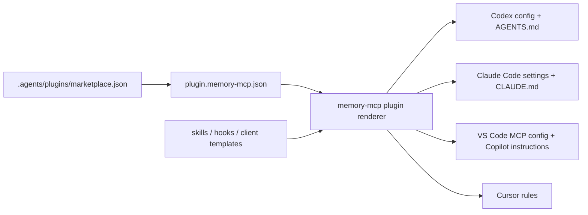

# memory-mcp Plugin Marketplace Model

**Date:** 2026-05-15
**Status:** Draft for review

## Goal

Turn the existing Claude Code, Codex, VS Code Copilot, and Cursor setup
templates into a local plugin marketplace model. Plugins should bundle the
skills, hooks, MCP connection configuration, and agent instructions an
application wants its coding clients to use. The first implementation should
make these bundles discoverable and installable without moving memory
retrieval, storage, or hook execution into a runtime plugin system.

## Current State

`client-setups/` contains static templates for Codex, Claude Code, VS Code
Copilot, and Cursor:

- `client-setups/codex/AGENTS.md`
- `client-setups/codex/config.example.toml`
- `client-setups/claude-code/CLAUDE.md`
- `client-setups/claude-code/settings.example.json`
- `client-setups/vscode-copilot/.github/copilot-instructions.md`
- `client-setups/vscode-copilot/.vscode/mcp.json`
- `client-setups/cursor/.cursor/rules/memory-mcp.mdc`
- `client-setups/common/memory-mcp-agent-workflow.md`

`hooks/` contains reusable Python hook entrypoints for Claude Code session and
tool events. The current model works as documentation, but it does not describe
what a pack contains, how packs are listed, how Codex and Claude Code outputs
are rendered from one source of truth, how VS Code Copilot and Cursor receive
the same workflow guidance, or how teams can host multiple local packs for
different workspaces.

## Recommended Approach

Use a packaging and installer model for the first version.

This keeps the memory-mcp application stable while adding a local marketplace
surface around client assets. The marketplace owns plugin discovery and
installation artifacts; the MCP server continues to own memory retrieval,
storage, auth, and tool behavior.

Rejected alternatives:

- Runtime plugin registry inside the MCP server: more powerful, but it expands
  the trusted execution surface before there is a concrete need for dynamic
  server behavior.
- More static templates: low risk, but it preserves the current duplication and
  does not support a real local marketplace.

## Plugin Shape

Each plugin lives under `plugins/<plugin-name>/` and has a required manifest:

```text
plugins/<plugin-name>/
  .codex-plugin/plugin.json
  plugin.memory-mcp.json
  skills/
  hooks/
  clients/
    codex/
    claude-code/
    vscode-copilot/
    cursor/
  README.md
```

`.codex-plugin/plugin.json` follows the Codex plugin manifest convention so the
same package can appear in Codex plugin tooling. `plugin.memory-mcp.json` is the
memory-mcp-specific contract used by the installer. It declares:

- plugin id, display name, description, version, and category
- manifest schema version and minimum supported installer version
- included skill files
- included hook scripts and supported hook events
- MCP server definitions, including command, args, cwd, and environment hints
- supported server connection modes, such as local Docker, local HTTP, or remote
  authenticated server
- client targets: `codex`, `claude-code`, `vscode-copilot`, `cursor`, or any
  supported subset
- install outputs: files to render for the target repository or user-level
  client config

The memory-mcp manifest should be explicit and schema-validated. It should not
execute arbitrary install code in the first version.

## Marketplace Shape

The local marketplace lives at `.agents/plugins/marketplace.json`, matching the
Codex marketplace convention:

```json
{
  "name": "memory-mcp-local-marketplace",
  "interface": {
    "displayName": "memory-mcp Local Marketplace"
  },
  "plugins": [
    {
      "name": "memory-mcp-core",
      "source": {
        "source": "local",
        "path": "./plugins/memory-mcp-core"
      },
      "policy": {
        "installation": "AVAILABLE",
        "authentication": "ON_INSTALL"
      },
      "category": "Developer Tools"
    }
  ]
}
```

Marketplace entries are metadata only. Install behavior comes from the plugin's
memory-mcp manifest.

## Versioning And Update Checks

Every plugin manifest must include:

- `schema_version`: the manifest schema version, starting at `"1"`.
- `version`: the plugin package version, using semver-compatible strings.
- `min_memory_mcp_version`: the minimum memory-mcp installer version that can
  render the plugin.
- `update_channel`: local channel metadata such as `stable`, `beta`, or `dev`.

The installer should write an install receipt when a plugin is rendered:

```text
.memory-mcp/plugins/<plugin-name>.lock.json
```

The receipt records the plugin version, manifest schema version, source
marketplace path, rendered client target, selected server profile name, and
render timestamp. It must not store credentials or tokens.

Minimum update-check commands:

```text
memory-mcp plugins check-updates --marketplace .agents/plugins/marketplace.json
memory-mcp plugins check-updates memory-mcp-core --install-root <dir>
```

For the first slice, update checks are local-only: compare the install receipt
against the currently available local marketplace plugin. Remote marketplace
fetching and automatic updates remain out of scope. If a newer local plugin is
available, the command reports the current version, available version, source
path, and the render command needed to update.

## First-Run Server Binding And Authentication

Rendering client files is not enough for a first-time install. The plugin
installer needs a first-run setup flow that asks which memory-mcp server profile
the user wants the rendered clients to use.

Supported first-run profile choices:

- local Docker Compose server, using this repo's `docker-compose.yml`
- local already-running HTTP hook endpoint
- remote authenticated memory-mcp server
- manually supplied MCP stdio command

The installer should persist non-secret server profile metadata in a local
profile file, such as:

```text
.memory-mcp/profiles/<profile-name>.json
```

Profile metadata can include server kind, display name, MCP command shape,
base URL, workspace default, repo default, and client target defaults. It must
not store access tokens, refresh tokens, API keys, or connection strings.

Authentication is required when the selected server profile is remote or when
the server reports that auth is enabled. The design should integrate with the
existing auth layer and the upcoming hosted/remote hardening work. The plugin
installer should be able to request or validate an auth profile, but credential
storage must be delegated to the host client, OS credential store, environment
variables, or a future explicit auth-profile mechanism. Rendered repository
files should reference auth profile names or environment variable names, not
embed secrets.

This requirement gets its own backlog story because hosted server hardening
covers server-side authorization, while plugin first-run setup covers client
binding, profile selection, local update receipts, and safe credential handoff.

## First Bundled Plugin

Create `plugins/memory-mcp-core/` as the first marketplace plugin. It packages
the current default workflow:

- shared memory-first agent workflow
- Codex `AGENTS.md` output
- Codex MCP server config output
- Claude Code `CLAUDE.md` output
- Claude Code `settings.json` MCP and hook output
- VS Code Copilot instruction output
- VS Code MCP config output
- Cursor rule output
- existing hook scripts for session start, session end, post tool use, and user
  prompt submit

The existing files in `client-setups/` should remain as compatibility templates
for now, but their README should point users to the plugin marketplace path as
the preferred install model.

## Installer Behavior

Add a small Python CLI module, likely under `src/memory_mcp/plugins/`, with a
script entry reachable through the existing `memory-mcp` console command or a
new subcommand once a CLI exists.

Minimum commands:

```text
memory-mcp plugins list --marketplace .agents/plugins/marketplace.json
memory-mcp plugins show memory-mcp-core
memory-mcp plugins setup memory-mcp-core --client codex
memory-mcp plugins render memory-mcp-core --client codex --output <dir>
memory-mcp plugins render memory-mcp-core --client claude-code --output <dir>
memory-mcp plugins render memory-mcp-core --client vscode-copilot --output <dir>
memory-mcp plugins render memory-mcp-core --client cursor --output <dir>
```

`render` writes deterministic files into an output directory. It does not edit a
user's live Codex, Claude Code, VS Code, or Cursor configuration in the first
version. This avoids unsafe config mutation and makes the output easy to review,
commit, or copy into client config through existing setup workflows.

`setup` is the interactive first-run command. It asks for the server profile,
validates required authentication for that profile, and then delegates to
`render`. If a non-interactive environment calls `setup`, it should accept flags
for profile name, server kind, base URL, workspace, repo, and auth profile.

## Data Flow



## Validation And Errors

The installer should validate before rendering:

- marketplace entry points to an existing local plugin path
- both manifests are valid JSON
- plugin names match their directory and marketplace entry
- plugin version and manifest schema version are present and supported
- declared client targets exist
- declared hooks exist under the plugin
- declared MCP server configs include command and args
- selected server profile exists or can be created during setup
- remote/auth-enabled server profiles have an auth profile or explicit
  environment-backed credential configuration
- output files are deterministic

Errors should be clear and non-destructive. Rendering to an existing non-empty
directory should require an explicit overwrite flag.

## Testing

Use test-first implementation when coding starts.

Expected focused tests:

- manifest loader accepts a valid `memory-mcp-core` plugin
- manifest loader rejects missing required fields
- marketplace loader lists local plugins in marketplace order
- update checker reports no update when the install receipt matches the local
  plugin version
- update checker reports available update when the local marketplace version is
  newer than the install receipt
- first-run setup records a non-secret server profile
- first-run setup requires authentication metadata for a remote server profile
- renderer emits Codex outputs from one plugin source
- renderer emits Claude Code outputs from one plugin source
- renderer emits VS Code Copilot outputs from one plugin source
- renderer emits Cursor outputs from one plugin source
- renderer refuses to overwrite existing output unless explicitly allowed

Existing hook tests should stay in place. Hook behavior does not change in this
first slice.

## Out Of Scope

- Dynamic runtime loading of Python code into the MCP server
- Remote marketplace fetching
- Signed plugins or trust policy
- Automatic mutation of live Codex, Claude Code, VS Code, or Cursor config files
- Storing secrets, tokens, API keys, or connection strings in rendered repo files
- Full auth-provider implementation beyond integrating with existing and
  planned memory-mcp auth/profile mechanisms
- Cross-platform shell installer scripts
- New memory retrieval behavior
- New hook event semantics

## Rollout

1. Add plugin manifest schema and loader.
2. Add marketplace loader.
3. Add version/install-receipt model and local update checks.
4. Add non-secret server profile model and first-run setup flow.
5. Add deterministic client renderer.
6. Create `plugins/memory-mcp-core/` from the current templates and hook assets.
7. Update `client-setups/README.md` to mark plugin install as preferred while
   retaining template docs for manual installs.
8. Add tests for loader, validation, update checks, setup, and render output.

## Open Design Decision

The only remaining implementation-level choice is the CLI entrypoint. If the
repo lands a broader `memory-mcp` CLI first, plugin commands should be nested
under it. If not, the first slice can expose a focused script such as
`memory-mcp-plugin` and migrate it under the broader CLI later without changing
the manifest format.
